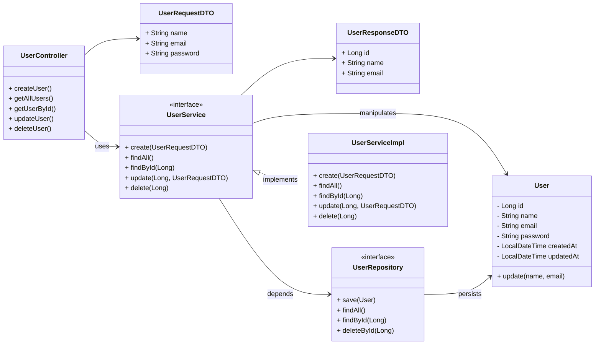
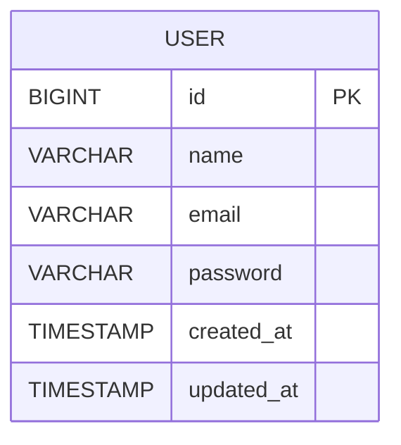

# 🚀 User CRUD API

API REST para gerenciamento de usuários, desenvolvida com **Spring Boot**.
Permite criar, listar, atualizar e deletar usuários.

---

## 📌 Objetivo

Este projeto tem como objetivo:

* Praticar desenvolvimento backend com Java
* Implementar um CRUD completo
* Aplicar boas práticas de arquitetura
* Servir como base para projetos maiores

---

## 🛠️ Tecnologias Utilizadas

* Java 25
* Spring Boot
* Spring Web
* Spring Data JPA
* H2 Database / PostgreSQL
* Maven

---

## 📁 Estrutura do Projeto

```bash
src/main/java/com/seuprojeto/users-api/
│
├── controller/
├── service/
├── repository/
├── domain/
├── dto/
├── exception/
└── UserCrudApplication.java
```

---

# 📊 📦 Diagrama de Classes (UML)



---

# 🗄️ 📊 Diagrama Entidade-Relacionamento (ERD)



---

# 🌐 Métodos HTTP e Endpoints

| Método | Endpoint    | Descrição             |
| ------ | ----------- | --------------------- |
| POST   | /users      | Criar usuário         |
| GET    | /users      | Listar usuários       |
| GET    | /users/{id} | Buscar usuário por ID |
| PUT    | /users/{id} | Atualizar usuário     |
| DELETE | /users/{id} | Deletar usuário       |

---

# ⚙️ Como executar o projeto

## 🔹 Pré-requisitos

* Java 25
* Maven

## 🔹 Passos

```bash
git clone https://github.com/seu-usuario/users-api.git
cd users-api
./mvnw spring-boot:run
```

---

# 📊 Exemplo de JSON

## 🔹 Request

```json
{
  "name": "João Silva",
  "email": "joao@email.com",
  "password": "123456"
}
```

## 🔹 Response

```json
{
  "id": 1,
  "name": "João Silva",
  "email": "joao@email.com"
}
```

---

# 🧠 Arquitetura do Projeto

## 🔷 Visão em camadas

```text
Controller → Service → Repository → Database
```

---

## 🔷 Responsabilidades

### Controller

* Recebe requisições HTTP
* Valida entrada
* Retorna respostas

### Service

* Contém regras de negócio
* Processa dados
* Orquestra fluxo

### Repository

* Comunicação com banco de dados
* Operações CRUD

### Domain

* Entidade principal (User)
* Regras do domínio

### DTO

* Transferência de dados entre camadas
* Evita exposição da entidade

---

# 🧪 Testes

(Adicionar testes futuramente)

---

# 🚀 Melhorias futuras

* [ ] Validação com Bean Validation
* [ ] Tratamento global de exceções
* [ ] Autenticação com JWT
* [ ] Integração com PostgreSQL
* [ ] Documentação com Swagger
* [ ] Testes unitários e integração

---

# 👨‍💻 Autor

Nathália Oliveira Santana

---

# 📄 Licença

Este projeto está sob a licença MIT.
